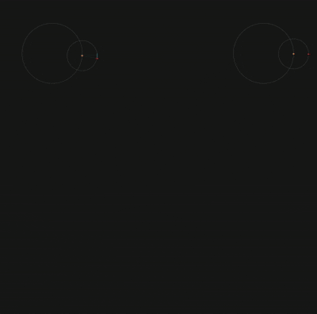

# Beautiful Mandala Curves

An interactive web visualization that generates stunning mandala patterns based on planetary orbital mechanics. Watch as mathematical curves transform into beautiful, symmetrical art!



## How It Works

These mandala patterns are created using **epicycloid mathematics** - the path traced by a point on a circle that rotates around another rotating circle. The ratio between the two rotation speeds (v1/v2) determines the final pattern:

- **Equal ratios** (e.g., v1=25, v2=50) create simple, closed patterns
- **Prime number ratios** (e.g., v1=17, v2=50) create complex spirals that take longer to close
- **Different combinations** produce an endless variety of beautiful symmetric designs

### Controls

1. **Preset Buttons**: Click any preset to instantly draw that pattern
2. **Sliders**: Adjust v1, v2, animation speed, and line width in real-time
3. **Continuous Mode**: Check this box for patterns that take longer to converge
4. **Action Buttons**:
   - **▶️ Animate**: Draw the pattern with animation showing the orbital mechanics
   - **⚡ Draw**: Instantly draw the complete pattern without animation
   - **🗑️ Clear**: Remove all curves from the canvas


### Tips

- Enable **Continuous Drawing Mode** for spirals that never fully close
- Try non-integer ratios like v1=17, v2=50 for mesmerizing spirals
- Experiment with different v1/v2 combinations to discover new patterns
- Use higher animation speeds to quickly preview patterns

## Technologies Stack

- **D3.js v7**
- **Bulma CSS**

## Mathematics

The curves are generated using the parametric equations:

```
x = centerX + r1 × cos(ratio × t) + r2 × cos(t)
y = centerY + r1 × sin(ratio × t) + r2 × sin(t)
```

Where:
- `ratio = v1 / v2` (the speed ratio)
- `r1` = radius of the larger orbit (60% of canvas)
- `r2` = radius of the smaller orbit (30% of canvas)
- `t` = time parameter from 0 to 2π × cycles

## Examples

Try these combinations for interesting patterns:

- **v1=15, v2=50**: Beautiful 7-petal flower
- **v1=10, v2=50**: Perfect 5-pointed star
- **v1=20, v2=50**: Classic clover shape
- **v1=40, v2=80**: Single heart
- **v1=17, v2=50**: Never-ending spiral (use continuous mode!)
- **v1=1, v2=100**: Simple circle
- **v1=99, v2=100**: Nearly circular with tiny wobble

## Inspiration

This project was inspired by the mathematical beauty of planetary orbital patterns and how simple rotation mechanics can create incredibly complex and beautiful designs. The same mathematics that governs celestial mechanics creates stunning visual art!


